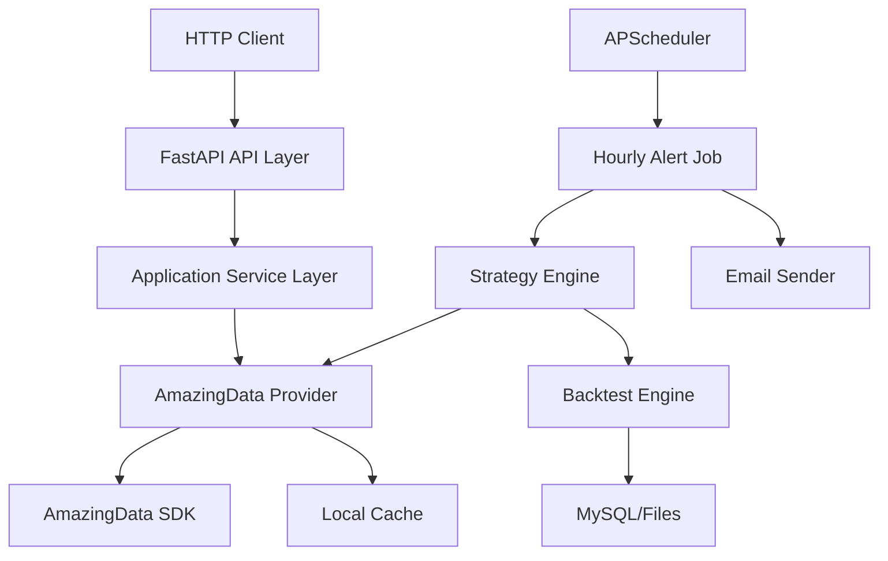

# AmazingData Python 项目系统设计文档

生成日期：2026-06-11

## 1. 背景与目标

本项目是一个基于 AmazingData 金融数据接口的 Python 服务，第一阶段目标包括两类能力：

1. 对外提供 HTTP 查询接口：
   - ETF 价格查询
   - A 股价格查询
   - 基金价格查询
   - 入参为代码、开始日期、结束日期，日期格式 `YYYYMMDD`
   - 日期不传时默认查询最近 10 个交易日
2. 提供 A 股“做 T 提醒”能力：
   - 用户输入 A 股代码
   - 系统基于历史日线与小时级 K 线生成做 T 策略方案
   - 对策略做 2 到 3 年历史回测，验证策略有效性
   - 后续每个交易日每小时运行一次
   - 当出现较适合买入的点位时，发送邮件提醒
   - 邮件中说明当前买点胜率、预期收益、预计卖出点位、止损点位、信号依据与风险提示

本系统仅输出研究、回测和提醒结果，不保证收益，不构成投资建议。交易执行由用户自行判断。

## 2. 需求补全与关键漏洞

原始需求存在以下需要补齐的点。本设计给出默认处理方式，并列为后续可配置项。

| 问题 | 风险 | 默认设计 |
| --- | --- | --- |
| “基金价格查询”口径不清 | 场内 ETF、LOF、场外基金净值接口不同 | 第一阶段同时支持场内基金/ETF K 线行情和场外开放式基金净值查询 |
| 默认最近 10 个交易日需要交易日历 | 自然日会包含周末、节假日 | 使用 `BaseData.get_calendar()` 取交易日历，倒推最近 10 个交易日 |
| 价格是否复权未定义 | 不复权回测会受分红送转影响 | A 股策略和回测默认使用前复权 OHLC；对外行情接口默认返回原始价，支持 `adjust=none/forward` |
| 小时级 K 线是否等于 60 分钟线 | “小时线”可能与交易时段切分不一致 | 使用 `Period.min60.value`；若需要 30 分钟或 120 分钟，作为策略参数扩展 |
| “比较适合买入”缺少标准 | 容易变成主观推荐 | 策略信号必须由可复现规则产生，并通过回测统计胜率、收益、回撤、样本数 |
| 回测 2 到 3 年区间未定 | 不同市场状态影响结果 | 默认 3 年，最少 2 年；若 3 年数据不足则降级到可用区间并标注 |
| 交易成本、滑点、停牌、涨跌停未定义 | 回测收益会高估 | 默认券商佣金万一，印花税和滑点单独配置；涨跌停/停牌信号不可交易 |
| 做 T 仓位假设未定义 | 无法计算收益和风险 | 默认已有底仓；单次做 T 金额在 5000 到 20000 元之间，按信号把握程度动态调整 |
| 卖出点位未定义 | 邮件无法给出可执行区间 | 由策略生成目标价、止损价、时间止盈条件；未达到目标则收盘前平 T 仓 |
| 邮件频率未定义 | 可能重复轰炸 | 交易日交易时间内整点执行；同一股票同一交易日同一策略信号只发送一次 |
| 实盘数据源未定义 | 用历史 K 线每小时查询会滞后 | 第一阶段使用当日 60 分钟 K 线/历史快照近似；若需要更及时，接入实时快照订阅 |
| 合规风险 | 系统看似直接荐股 | 邮件和 API 响应必须附带“仅供研究参考，不构成投资建议” |

## 3. 数据接口依据

AmazingData 相关接口与项目使用方式：

| 能力 | AmazingData 对象/接口 | 用途 |
| --- | --- | --- |
| 登录 | `ad.login()` | 服务启动时登录，凭证来自环境变量 |
| 交易日历 | `BaseData.get_calendar()` | 默认日期、交易日判断、调度判断 |
| 当前代码表 | `BaseData.get_code_list(security_type=...)` | 校验 A 股、ETF/基金代码合法性 |
| 历史代码表 | `BaseData.get_hist_code_list(...)` | 回测时包含退市/历史有效代码，降低幸存者偏差 |
| 历史 K 线 | `MarketData.query_kline(...)` | 查询 A 股、ETF、基金日线和 60 分钟线 |
| 历史快照 | `MarketData.query_snapshot(...)` | 可用于当日价格状态和更细粒度提醒 |
| 后复权因子 | `BaseData.get_backward_factor(...)` | A 股前复权价格计算 |
| ETF 份额 | `InfoData.get_fund_share(...)` | ETF 扩展信息 |
| ETF 净值 | `InfoData.get_fund_nav(...)` | ETF 净值扩展信息 |
| ETF IOPV | `InfoData.get_fund_iopv(...)` | ETF 估值扩展信息 |
| 场外开放式基金净值 | `InfoData.get_fund_nav(...)` | 按基金代码查询单位净值、累计净值、复权单位净值等 |

`Period` 使用：

| 周期 | 枚举 |
| --- | --- |
| 日线 | `ad.constant.Period.day.value` |
| 小时级 | `ad.constant.Period.min60.value` |
| 30 分钟扩展 | `ad.constant.Period.min30.value` |
| 120 分钟扩展 | `ad.constant.Period.min120.value` |

## 4. 技术选型

| 模块 | 选型 | 说明 |
| --- | --- | --- |
| HTTP 服务 | FastAPI | 类型提示清晰，适合数据 API |
| 后台任务 | APScheduler | 每小时定时任务、交易日过滤 |
| 数据处理 | pandas / numpy | K 线、指标、回测 |
| 数据源 | AmazingData | 行情、代码表、交易日历、ETF 数据 |
| 缓存 | 本地 HDF5/Parquet + MySQL 5.7 | AmazingData 支持 local_path；项目配置、回测结果和提醒记录存入项目自有 MySQL 库 |
| 邮件 | SMTP | 默认使用 163 邮箱 SMTP，具体账号授权信息后补 |
| 配置 | `.env` + Pydantic Settings | 管理账号、邮件、回测参数 |
| 测试 | pytest | 单元测试、接口测试、回测一致性测试 |

## 5. 总体架构



分层说明：

| 层 | 职责 |
| --- | --- |
| API Layer | 参数校验、响应格式、错误码 |
| Application Service | 编排查询、默认交易日、资产类型校验 |
| Data Provider | 封装 AmazingData 登录、K 线、交易日历、复权、缓存 |
| Strategy Engine | 指标计算、做 T 信号、目标价/止损价生成 |
| Backtest Engine | 规则回测、绩效统计、防未来函数 |
| Scheduler | 交易日每小时执行提醒任务 |
| Mailer | 邮件模板、去重、发送记录 |
| Store | 策略配置、回测结果、提醒记录 |

## 6. 推荐项目结构

```text
t-alpha/
  README.md
  backend/
    pyproject.toml
    .env.example
    src/
      t_alpha/
        main.py
        config.py
        api/
          routes_market.py
          routes_strategy.py
          schemas.py
        data/
          amazingdata_client.py
          calendar.py
          market_data.py
          adjust.py
        indicators/
          technical.py
        strategy/
          t0_strategy.py
          signal.py
          risk.py
        backtest/
          engine.py
          metrics.py
        scheduler/
          jobs.py
        notification/
          email_sender.py
        storage/
          models.py
          repository.py
    tests/
      test_calendar.py
      test_market_api.py
      test_backtest_engine.py
      test_t0_strategy.py
  web-admin/
  docs/
    amazingdata_trading_system_design.md
```

`indicators/technical.py` 可以参考 `ad_technical_analysis/scripts/run_technical_analysis.py` 中的 `TechnicalIndicators`，重点复用 MACD、KDJ、RSI、BOLL、ATR、均线、成交量类指标。不要直接复用脚本中的 CLI 输出逻辑，应抽出纯函数或类。

`data/amazingdata_client.py` 可以参考 `ad_factor_analysis/scripts/data_provider.py` 中的懒加载、日期转换、K 线矩阵封装和 local_path 缓存思路，但不得保留示例脚本里的默认账号密码。所有凭证必须来自环境变量。

## 7. HTTP API 设计

### 7.1 通用参数

| 参数 | 类型 | 必填 | 默认 | 说明 |
| --- | --- | --- | --- | --- |
| `code` | string | 是 | 无 | 证券代码，如 `510300.SH`、`000001.SZ` |
| `start_date` | string | 否 | 最近第 10 个交易日 | `YYYYMMDD` |
| `end_date` | string | 否 | 最近一个交易日 | `YYYYMMDD` |
| `period` | string | 否 | `day` | `day`、`60m`，第一阶段价格接口默认日线 |
| `adjust` | string | 否 | `none` | `none`、`forward` |

日期默认规则：

1. 若 `start_date` 和 `end_date` 都为空，使用交易日历最近 10 个交易日。
2. 若只传 `end_date`，`start_date` 为 `end_date` 往前第 10 个交易日。
3. 若只传 `start_date`，`end_date` 为最近一个交易日。
4. 若日期不是交易日，按交易日历向前取最近交易日，并在响应中返回 `normalized_dates`。

### 7.2 ETF 价格查询

`GET /api/v1/market/etf/prices`

示例：

```http
GET /api/v1/market/etf/prices?code=510300.SH&start_date=20240101&end_date=20240131
```

数据实现：

- 校验代码是否在 `EXTRA_ETF`
- 调用 `MarketData.query_kline(code_list=[code], period=Period.day.value)`
- 可扩展返回 `fund_nav`、`fund_iopv`

### 7.3 A 股价格查询

`GET /api/v1/market/stock/prices`

示例：

```http
GET /api/v1/market/stock/prices?code=000001.SZ&adjust=forward
```

数据实现：

- 校验代码是否在 `EXTRA_STOCK_A` 或 `EXTRA_STOCK_A_SH_SZ`
- 调用 `MarketData.query_kline`
- 若 `adjust=forward`，用 `BaseData.get_backward_factor` 做前复权

### 7.4 基金价格与净值查询

`GET /api/v1/market/fund/prices`

第一阶段定义：

- `fund/prices` 支持场内基金/ETF K 线行情，优先使用 `EXTRA_ETF`
- `fund/nav` 支持场外开放式基金净值查询，使用 `InfoData.get_fund_nav(...)`

实现方式：

- 先按 ETF/场内基金代码校验
- 调用 `MarketData.query_kline`
- 对场外开放式基金净值，调用 `InfoData.get_fund_nav([code], is_local=False)`，返回 `PRICE_DATE`、`ANN_DATE`、`UNIT_NAV`、`ACCUM_NAV`、`ADJ_UNIT_NAV`、`INNER_CODE`、`OUTER_CODE`
- 对 ETF 可附加份额和 IOPV：
  - `InfoData.get_fund_share`
  - `InfoData.get_fund_iopv`

`GET /api/v1/market/fund/nav`

示例：

```http
GET /api/v1/market/fund/nav?code=000001.OF&start_date=20240101&end_date=20240131
```

响应字段：

```json
{
  "code": "000001.OF",
  "requested_dates": {"start_date": "20240101", "end_date": "20240131"},
  "rows": [
    {
      "price_date": "20240102",
      "ann_date": "20240103",
      "unit_nav": 1.2345,
      "accum_nav": 2.3456,
      "adj_unit_nav": 1.4567,
      "inner_code": "",
      "outer_code": "000001"
    }
  ],
  "disclaimer": "仅供研究参考，不构成投资建议。"
}
```

### 7.5 响应格式

```json
{
  "code": "000001.SZ",
  "asset_type": "stock",
  "period": "day",
  "adjust": "forward",
  "requested_dates": {
    "start_date": "20240101",
    "end_date": "20240131"
  },
  "normalized_dates": {
    "start_date": "20240102",
    "end_date": "20240131"
  },
  "rows": [
    {
      "date": "20240102",
      "open": 10.12,
      "high": 10.30,
      "low": 10.01,
      "close": 10.20,
      "volume": 1234567,
      "amount": 12345678.9
    }
  ],
  "disclaimer": "仅供研究参考，不构成投资建议。"
}
```

## 8. 做 T 策略设计

### 8.1 设计原则

做 T 提醒不直接“预测涨跌”，而是输出基于历史统计的交易候选点。策略必须满足：

1. 信号规则可复现。
2. 每个信号都有历史样本数、胜率、期望收益、盈亏比、最大回撤。
3. 回测不得使用未来数据。
4. 邮件提醒必须包含止损、失效条件和风险提示。
5. 信号质量不足时不发送提醒。

### 8.2 数据输入

| 数据 | 周期 | 用途 |
| --- | --- | --- |
| 前复权日线 OHLCV | 3 年以上 | 判断中期趋势、波动、支撑压力 |
| 前复权 60 分钟 OHLCV | 2 到 3 年 | 生成小时级买卖点 |
| 当日 60 分钟 K 线或快照 | 当前交易日 | 实盘提醒判断 |
| 交易日历 | 全量 | 调度、回测窗口、默认日期 |

仓位输入：

| 参数 | 默认值 | 用途 |
| --- | --- | --- |
| 是否已有底仓 | 是 | 做 T 默认基于已有持仓，不负责底仓建仓 |
| 单次最小做 T 金额 | 5000 元 | 低把握信号的买入金额 |
| 单次最大做 T 金额 | 20000 元 | 高把握信号的买入金额上限 |
| 动态金额依据 | 信号评分 | 按胜率、期望收益、回撤、样本数综合评分 |

### 8.3 第一阶段策略规则

推荐从一个“均值回归 + 趋势过滤 + 波动止损”的可解释策略开始。

日线过滤：

1. `MA20 > MA60` 或收盘价在 `MA60` 上方，认为中期趋势未破坏。
2. `ATR20 / close` 不高于近一年 80% 分位，过滤异常高波动。
3. 最近 20 日成交额均值达到最低流动性阈值，避免流动性不足。

小时级买入信号：

1. 当前 60 分钟收盘价接近布林下轨或日内 VWAP 下方。
2. RSI6 低于阈值后回升。
3. KDJ 的 J 值从低位拐头。
4. 成交量未出现明显放大下跌，避免趋势性杀跌。

卖出目标：

1. 第一目标价：买入价 + `0.6 * ATR60m_14`
2. 第二目标价：小时级 BOLL 中轨或 VWAP
3. 止损价：买入价 - `0.4 * ATR60m_14`
4. 时间止盈/止损：若当日收盘前仍未触发卖出条件，给出“收盘前平 T 仓”提醒

信号过滤：

- 最近 2 到 3 年同类信号样本数 `< 30`：不提醒
- 胜率 `< 55%`：不提醒
- 扣成本后期望收益 `<= 0`：不提醒
- 最大连续亏损超过阈值：降低信号等级或不提醒

买入金额计算：

- `confidence_level=low`：5000 元
- `confidence_level=medium`：10000 到 15000 元
- `confidence_level=high`：15000 到 20000 元
- 若价格导致无法整手买入，则按 A 股 100 股整数手向下取整；不足 1 手则不提醒
- 邮件中同时展示建议金额和对应股数

### 8.4 策略输出

```json
{
  "code": "000001.SZ",
  "signal_time": "2026-06-11 10:00:00",
  "signal": "candidate_buy",
  "confidence_level": "medium",
  "current_price": 10.23,
  "suggested_buy_zone": [10.18, 10.25],
  "suggested_amount": 10000,
  "suggested_shares": 900,
  "expected_sell_price": 10.39,
  "stop_loss_price": 10.12,
  "win_rate": 0.587,
  "expected_return": 0.0068,
  "sample_count": 84,
  "max_drawdown": -0.041,
  "holding_rule": "当日达目标价卖出；未达目标则收盘前平 T 仓",
  "reasons": [
    "日线趋势过滤通过",
    "60分钟价格触及布林下轨附近",
    "RSI6低位回升",
    "扣成本后期望收益为正"
  ],
  "disclaimer": "仅供研究参考，不构成投资建议。"
}
```

## 9. 回测设计

### 9.1 回测窗口

- 默认：最近 3 年交易日
- 最少：最近 2 年交易日
- 训练/验证：
  - 参数寻优期：前 70%
  - 验证期：后 30%
  - 实际提醒使用验证期表现作为主要参考

### 9.2 回测假设

| 项 | 默认值 |
| --- | --- |
| 初始底仓 | 用户已有底仓，不在系统中建仓 |
| 单次 T 仓金额 | 5000 到 20000 元，按信号把握程度动态调整 |
| 每日交易次数 | 最多 1 次买入 + 1 次卖出 |
| 买入成交价 | 下一根 60 分钟 K 线开盘价，或当前信号价加滑点 |
| 卖出成交价 | 达目标价按目标价扣滑点，否则时间规则价 |
| 券商佣金 | 默认万一，可配置 |
| 印花税 | 单独配置，默认卖出万五 |
| 滑点 | 单边 1bp，可配置 |
| 涨跌停/停牌 | 不允许成交 |

### 9.3 回测指标

必须输出：

- 信号样本数
- 胜率
- 平均收益
- 中位数收益
- 扣成本后期望收益
- 盈亏比
- 最大回撤
- 最大连续亏损次数
- 平均持仓时长
- 分年份表现
- 最近 3 个月表现

可选输出：

- 参数敏感性分析
- 牛熊震荡分市场状态表现
- 与简单基线策略对比

## 10. 定时提醒设计

### 10.1 调度规则

默认每个交易日交易时间内整点运行：

- 10:00
- 11:00
- 13:00
- 14:00
- 15:00

9:30 开盘后不在整点，因此首个检查点为 10:00；11:30 到 13:00 为午休，不执行；15:00 用于收盘前后信号复核。只有出现符合阈值的买点时才发送邮件。

流程：

1. 判断今天是否为交易日。
2. 判断当前时间是否在有效交易检查点。
3. 对用户关注股票列表逐个拉取最新日线、60 分钟线或快照。
4. 运行策略信号。
5. 查询当日是否已发过同类提醒。
6. 达到阈值则发送邮件。
7. 保存提醒记录。

### 10.2 邮件内容

邮件标题：

```text
[做T提醒] 000001.SZ 出现候选买点 胜率58.7% 预期收益0.68%
```

邮件正文：

- 股票代码和信号时间
- 当前价格
- 建议关注买入区间
- 建议买入金额和股数
- 预计卖出点位
- 止损点位
- 历史样本数
- 胜率
- 扣成本后预期收益
- 最大回撤和连续亏损风险
- 触发原因
- 失效条件
- 风险提示

## 11. 数据存储设计

第一阶段使用 MySQL 5.7 存储项目配置、回测结果和提醒记录；行情原始数据优先使用 AmazingData 的本地缓存机制，项目侧只保存必要的派生结果与任务状态。

### 11.1 数据库边界

测试数据库连接信息由环境变量提供：

```text
DB_HOST=47.93.240.45
DB_USERNAME=testroot
DB_PASSWORD=zbmlhj8s
DB_PORT=3306
DB_NAME=t_alpha
```

数据库操作约束：

1. 项目只允许连接并操作 `t_alpha` 这个自有库。
2. 初始化时只允许执行 `CREATE DATABASE IF NOT EXISTS t_alpha DEFAULT CHARACTER SET utf8mb4`。
3. 禁止执行跨库 `DROP DATABASE`、`DROP TABLE`、`TRUNCATE` 或删除其他业务库数据。
4. 迁移脚本必须显式指定库名或在连接串中绑定 `DB_NAME=t_alpha`。
5. 生产代码中禁止硬编码数据库密码；上述值仅用于本地 `.env` 或部署环境变量。
6. 若未来接入正式库，必须单独配置账号权限，权限范围限定在项目库内。

### 11.2 表设计

`watchlist`

| 字段 | 类型 | 说明 |
| --- | --- | --- |
| id | integer | 主键 |
| code | text | 股票代码 |
| name | text | 股票名称 |
| enabled | boolean | 是否启用 |
| strategy_name | text | 策略名称 |
| note | text | 备注 |
| created_at | datetime | 创建时间 |
| updated_at | datetime | 更新时间 |

初始监控样例：

```sql
INSERT INTO watchlist (code, name, enabled, strategy_name, note, created_at, updated_at)
VALUES ('601318.SH', '中国平安', 1, 'mean_reversion_t0_v1', '用户指定的首个测试与监控股票', NOW(), NOW());
```

`strategy_backtests`

| 字段 | 类型 | 说明 |
| --- | --- | --- |
| id | integer | 主键 |
| code | text | 股票代码 |
| strategy_name | text | 策略名称 |
| start_date | text | 回测开始日期 |
| end_date | text | 回测结束日期 |
| params_json | text | 参数 |
| metrics_json | text | 绩效指标 |
| report_path | text | 回测报告路径 |
| created_at | datetime | 创建时间 |

`alert_records`

| 字段 | 类型 | 说明 |
| --- | --- | --- |
| id | integer | 主键 |
| code | text | 股票代码 |
| signal_time | datetime | 信号时间 |
| signal_type | text | 信号类型 |
| payload_json | text | 邮件/信号内容 |
| sent | boolean | 是否发送成功 |
| error_message | text | 失败原因 |
| created_at | datetime | 创建时间 |

## 12. 配置设计

环境变量：

```text
AD_USERNAME=210400052339
AD_PASSWORD=Ttxs0727
AD_HOST=140.206.44.234
AD_PORT=8600

AMAZINGDATA_LOCAL_PATH=D:/AmazingData_local_data/

DB_HOST=47.93.240.45
DB_PORT=3306
DB_USERNAME=testroot
DB_PASSWORD=zbmlhj8s
DB_NAME=t_alpha

SMTP_HOST=smtp.163.com
SMTP_PORT=465
SMTP_USERNAME=
SMTP_PASSWORD=
SMTP_FROM=
ALERT_TO=

APP_ENV=dev
LOG_LEVEL=INFO
```

安全要求：

- 上述 AmazingData 与 MySQL 凭证只应放在本地 `.env`、部署环境变量或密钥管理系统中。
- `.env` 必须加入 `.gitignore`。
- 日志中不得打印 `AD_PASSWORD`、`DB_PASSWORD`、SMTP 密码等敏感字段。

策略配置示例：

```yaml
t0_strategy:
  lookback_years: 3
  min_sample_count: 30
  min_win_rate: 0.55
  min_expected_return: 0.001
  max_daily_signals_per_code: 1
  min_trade_amount: 5000
  max_trade_amount: 20000
  commission_rate: 0.0001
  stamp_tax_rate: 0.0005
  slippage_bps: 1
  default_test_code: "601318.SH"
```

## 13. 错误处理与边界情况

| 场景 | 处理 |
| --- | --- |
| AmazingData 登录失败 | 服务启动失败，日志明确提示缺少或错误凭证 |
| 代码不存在 | HTTP 400，返回合法代码格式要求 |
| 日期格式错误 | HTTP 422，提示 `YYYYMMDD` |
| 查询区间无交易日 | HTTP 400，提示调整日期 |
| 数据为空 | HTTP 404，说明数据源未返回该代码该区间数据 |
| 复权因子缺失 | 返回原始价并在 metadata 中标记 |
| 小时 K 线不足 | 策略不运行，只返回“数据不足” |
| 样本数不足 | 不发邮件，记录跳过原因 |
| 邮件发送失败 | 重试 3 次，失败后写入 `alert_records` |

## 14. 测试计划

单元测试：

- 日期字符串转换和交易日默认逻辑
- 代码类型校验
- 前复权计算
- 技术指标计算是否稳定处理空值和除零
- 策略信号规则
- 回测成交、手续费、滑点、止损、止盈

集成测试：

- AmazingData 登录配置检查
- MySQL 5.7 连接检查，只验证 `t_alpha` 库可读写
- `/market/stock/prices`、`/market/etf/prices`、`/market/fund/prices`、`/market/fund/nav`
- 使用 `601318.SH` 中国平安回测 2 到 3 年数据
- 将 `601318.SH` 写入 watchlist 并验证提醒任务可读取
- 调度任务在非交易日不运行
- 邮件发送使用 mock SMTP

回测验证：

- 禁止未来函数：信号只能使用当前 K 线及之前数据
- 成交价格不能使用同一根 K 线的未来 high/low 直接理想成交
- 参数寻优结果必须在验证集复核

## 15. 分阶段实施计划

### 阶段 1：数据与 HTTP 查询

1. 创建 Python 项目结构。
2. 封装 AmazingData 登录与对象懒加载。
3. 实现交易日历默认日期逻辑。
4. 实现 A 股、ETF、基金价格查询接口。
5. 接入 MySQL 5.7，并初始化 `t_alpha` 项目库。
6. 增加基础单元测试和 API 测试。

### 阶段 2：技术指标与回测

1. 抽取技术指标纯函数。
2. 实现日线和 60 分钟 K 线加载。
3. 实现做 T 策略规则。
4. 实现回测引擎和绩效统计。
5. 以 `601318.SH` 中国平安作为默认测试标的生成回测报告。

### 阶段 3：定时提醒与邮件

1. 实现 watchlist。
2. 实现 APScheduler 交易日定时任务。
3. 实现邮件模板和去重。
4. 加入提醒记录和失败重试。
5. 以 `601318.SH` 完成端到端演练。

### 阶段 4：增强

1. 支持多策略参数组合。
2. 增加实时快照订阅。
3. 增加 Web 管理页面。
4. 增加更严格的风控过滤。
5. 引入基本面过滤，例如排除 ST、低流动性、高风险财务状态股票。

## 16. 已确认项

以下事项来自用户对此前问题的回复，已纳入设计和实施计划：

1. 基金数据：场内基金/ETF K 线和场外开放式基金净值都需要支持。
2. 做 T 底仓：默认已有底仓。
3. 做 T 金额：单次做 T 金额为 5000 到 20000 元，按买点把握程度动态调整。
4. 邮件服务：默认使用 163 邮箱；具体邮箱账号、授权码和收件人后补。
5. 费率配置：券商佣金配置项默认万一；印花税和滑点保留独立配置。
6. 定时执行：交易日交易时间内整点执行，只有出现合适买点才发邮件。
7. 监控标的：watchlist 默认支持多只股票；首只测试和监控标的为 `601318.SH` 中国平安。

## 17. 风险声明

本系统输出为量化研究和提醒结果。历史回测不代表未来表现，胜率和预期收益均依赖历史样本、参数、交易成本和市场环境。系统不自动下单，不提供收益承诺，用户应自行承担投资风险。
